# Task 128b: photo policy applied, sweep of every photo Code placed since 20 September

Date: 2026-09-24. Policy as written by Roman today (now in SETUP.md): one photo per profile, from the bar's own website or Instagram only, interiors only (the room, or the counter with its seating, as a guest sees it), never Falstaff, Google, press or third parties; credit shown as "Photo: <Bar name>" inside the hero; owner photos replace it; removal on request the same day; and from today Code never publishes a scraped photo directly: candidates are staged in `outreach/photos-staged/<slug>/` and listed here as a contact sheet for approval.

## 1. Heidelberg (task 128)

- **Schilling Roofbar:** the bottle-shelf photo was replaced with the dining-room frame from the bar's own site (a still from its hero video, tables and windows as a guest sees them) before the approval step arrived. Excluded from the sheet per Roman. Live at /bars/schilling-roofbar-heidelberg with "Photo: Schilling Roofbar".
- **Bent Bar:** passes (the counter with its green stools, the room behind). Live, counts as staged, on the sheet below.
- **15 High:** passes (the 15th-floor room with the window wall). Live, counts as staged, on the sheet below.
- **Cocktail-Café Regie:** passes (the dining room with the wings). Live, counts as staged, on the sheet below.
- **Frollein Bent, Lino's Bar:** no photo; nothing on their own channels passes (the shared bentbar.de site has no garden image; Lino's has no site).
- Credits on all four live photos read "Photo: <Bar name>" in the hero (the database holds the bar name; the hero adds the prefix).

### Contact sheet, Heidelberg (reply with the slugs to approve)

| Slug | Candidate | Source |
|---|---|---|
| bent-bar-heidelberg | 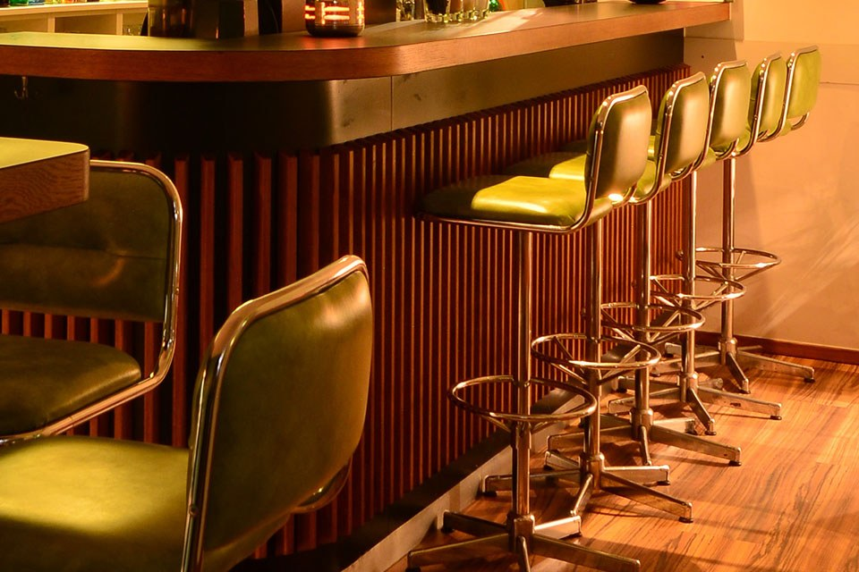 | https://bentbar.de/wp-content/uploads/2021/06/bent-bar-back-2.jpg (bentbar.de home page) |
| 15-high-heidelberg | 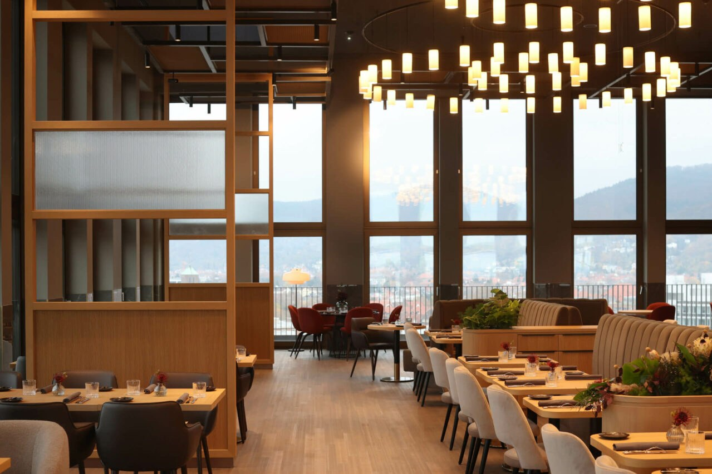 | https://www.15high-heidelberg.de/wp-content/uploads/sites/8/2023/12/restaurant-15high-heidelberg-02.jpg (15high-heidelberg.de home page) |
| cocktail-cafe-regie-heidelberg | 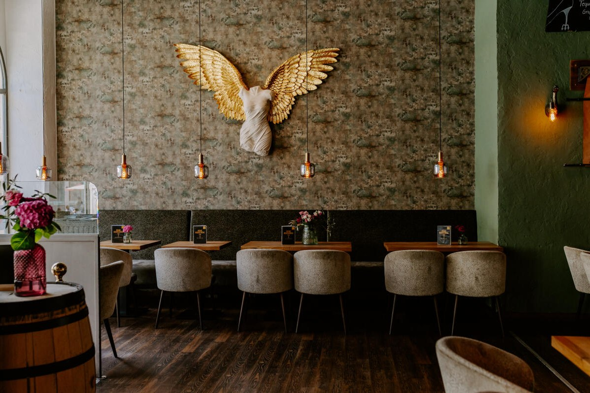 | https://dtwaeonhht2im.cloudfront.net/5904a05834d9939e2c512d8b2910cf5d.jpg (regie-heidelberg.de home page) |

## 2. Every photo Code uploaded since 20 September

30 photo files carry an upload time from 20 September on. Four are owner uploads through the dashboard and stay as they are: KAA° Mixology, Cantina OK!, Bar Martinelli (Heidelberg) and, by the same token, nothing else was touched on claimed bars except as noted below.

**23 photos fail the policy on source:** the task 113 photos of 23 September, credited "courtesy of The 50 Best Bars", were taken from the50.com, a third-party site. Under the rule they have to come down, and each bar gets an own-site candidate staged for approval where one exists. The removal is a bulk delete of 23 files, which the session's permission guard refused to run on my own judgment; it needs Roman's go (section 4).

| Slug | Bar | Live photo (from the50.com) | Own-site result |
|---|---|---|---|
| bar-trench | Bar Trench, Tokyo | remove | none: the group site's only interiors belong to a sister bar; the Trench page has menus, an exterior and Instagram embeds |
| boadas | Boadas, Barcelona | remove | candidate staged (archival counter shot from boadascocktails.com) |
| boilermaker | Boilermaker, Goa | remove | none: no website on file (Instagram only) |
| g-o-d | G.O.D, Bangkok | remove | none: no website on file (Instagram only) |
| kumiko | Kumiko, Chicago | remove | candidate staged |
| naked-athens | Naked, Athens | remove | none: the site holds portraits, crowds, drinks and merchandise only |
| opium | Opium, Bangkok | remove | candidate staged |
| vender | Vender, Taichung | remove | none: venderbar.com is a dead page |
| bar-gabriel-istanbul | Bar Gabriel, Istanbul | remove | none: the "website" on file is its Instagram |
| form-matter | Form + Matter, Mexico City | remove | none: the site exposes a logo and an exterior render only |
| freni-e-frizioni | Freni e Frizioni, Rome | remove | none: every room image on the site is 600 px wide; the large ones are cocktail close-ups |
| front-back | Front/Back, Accra | remove | candidate staged |
| gucci-giardino | Gucci Giardino 25, Florence | remove | candidate staged |
| la-borracha-accra | La Borracha, Accra | remove | none: laborrachaghana.com does not resolve |
| mius | Mius, Hong Kong | remove | candidate staged |
| mo-bar-shenzhen | MO Bar, Shenzhen | remove | candidate staged (borderline: entrance hall, no seating in view) |
| otro-bar | Otro Bar, San José (owner-claimed, photo was ours) | remove | none: no website on file |
| r-da-huset | Röda Huset, Stockholm | remove | none: the only interior on the site carries a large World's 50 Best logo overlay |
| the-bellwood | The Bellwood, Tokyo | remove | none: no website on file |
| the-sg-club | The SG Club, Tokyo | remove | two candidates staged |
| three-horses-melbourne | Three Horses, Melbourne | remove | none: placeholder site with a logo, an illustration and menus |
| tjoget | Tjoget, Stockholm | remove | candidate staged |
| vesper | Vesper, Bangkok | remove | candidate staged (borderline: a panelled wall with mirrors and the banquette, not the whole room) |

Fourteen of the 23 have nothing on their own site that passes; if the removal is approved they stay without a photo until the owner supplies one.

## 3. Staged candidates from the bars' own sites (contact sheet)

Crops are 3:2 at up to 1500 px wide, centre-cropped from the source, in `outreach/photos-staged/<slug>/NN.jpg` with a `NN.source.txt` beside each. Reply with the slugs (and the number where there are two) to approve.

| Slug | Candidate | Source |
|---|---|---|
| boadas | 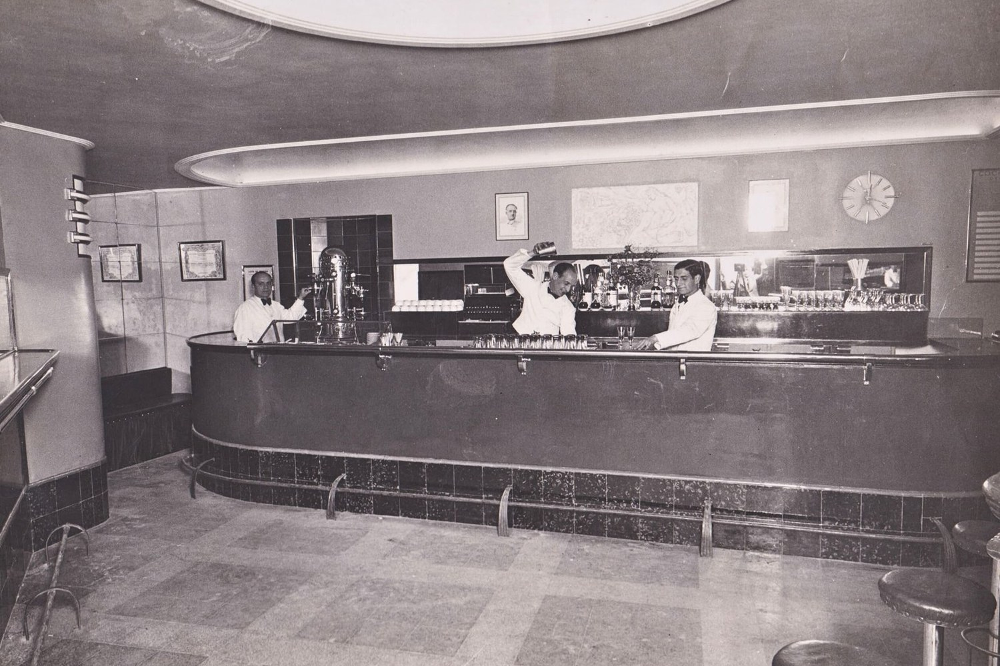 | https://boadascocktails.com/resources/img/raices-photo-3.jpg (boadascocktails.com/historia.html). Archival black-and-white; the site's colour photos are all portraits, crowds or drinks. |
| front-back | 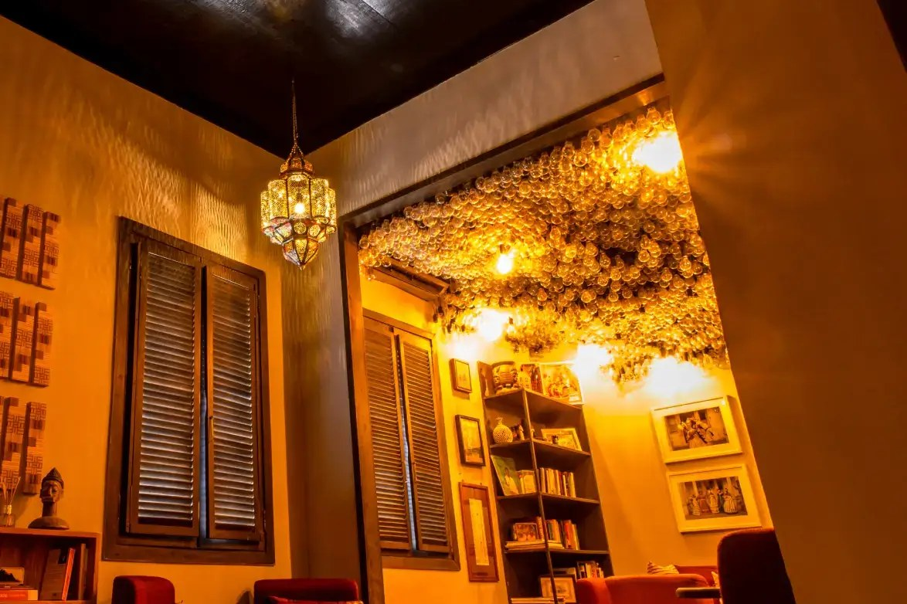 | https://cdn.prod.website-files.com/60a676b012dee37145d9e5f1/63de19a2dd1066e9b113dd0d_Home.webp (frontbackaccra.com). Portrait original, centre crop. |
| gucci-giardino | 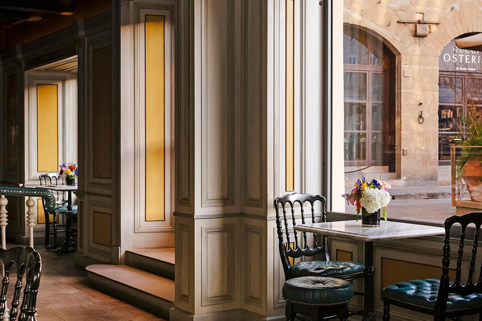 | https://backend.gucciosteria.com/wp-content/uploads/2026/01/Gucci_Giardino-Experiences.jpg (gucciosteria.com, Giardino page). Portrait original, centre crop. |
| kumiko | 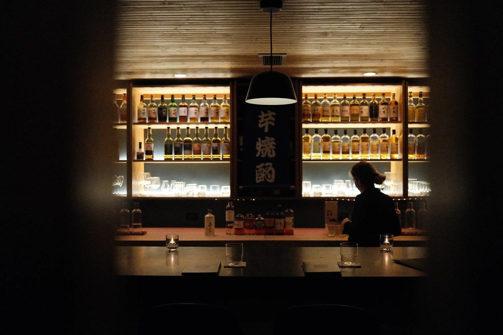 | https://cdn.prod.website-files.com/69f44919336ba9206e4cd7ba/6aa476cf1becfce8cfc21d81_06_Whisky_Bar1.webp (barkumiko.com). One bartender silhouette behind the counter. |
| mius | 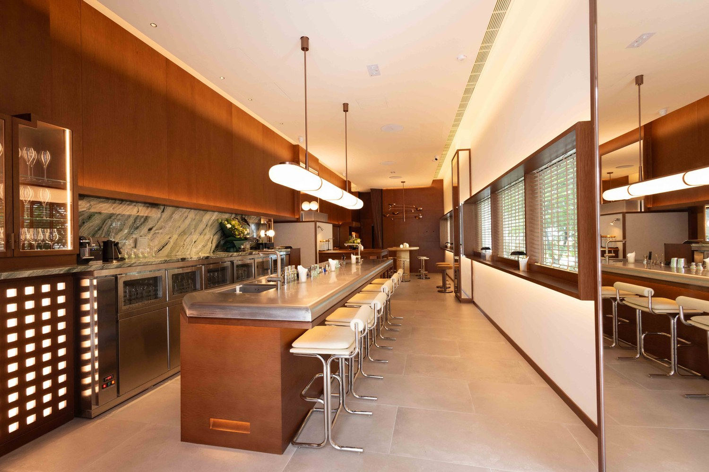 | https://static.wixstatic.com/media/2bd52c_9d41bd94d49e4971a686a5eec763c306~mv2.jpg (mius.hk) |
| mo-bar-shenzhen | 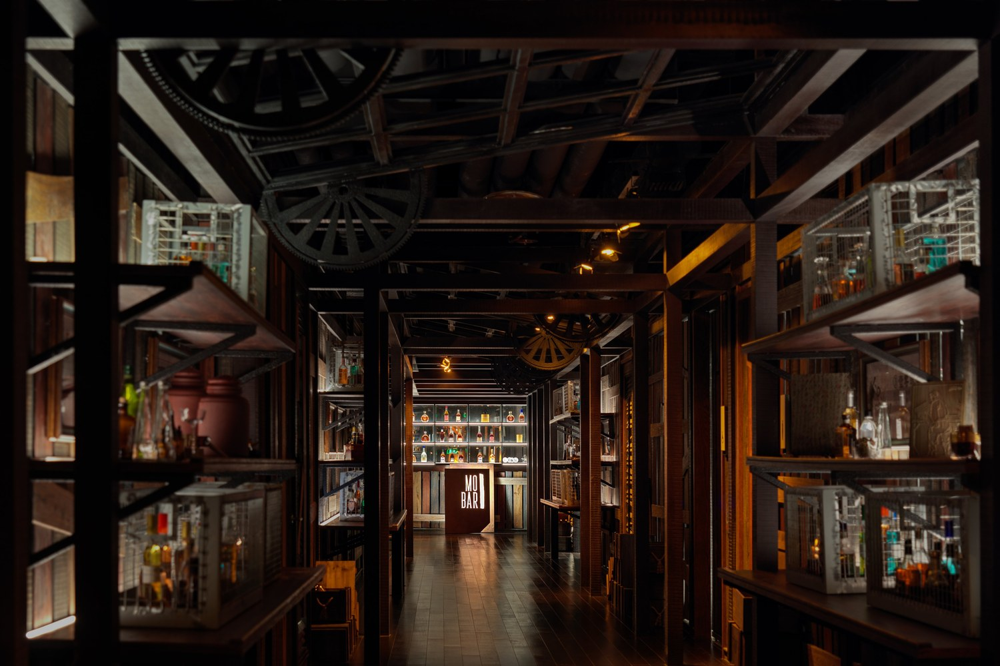 | https://media.ffycdn.net/eu/mandarin-oriental-hotel-group/eUJA8CSuYDsZQ3A7ZqKN.JPG (mandarinoriental.com, MO Bar page). Borderline: the entrance hall, no seating in view. |
| opium | 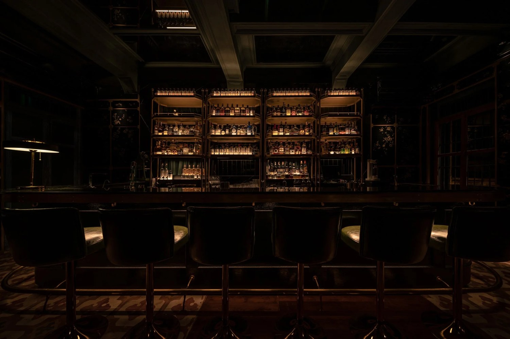 | https://images.squarespace-cdn.com/content/v1/606426f2a32cb67159564fbe/c7986731-3db3-44b9-af66-61e30f90533d/PTNG_RE-SIZE_057.jpeg (opiumbarbangkok.com/about) |
| the-sg-club (01) | 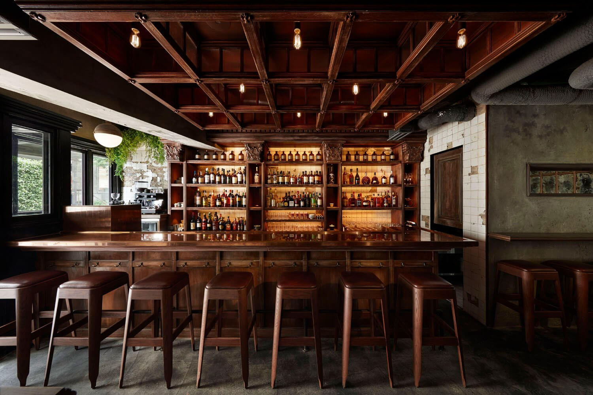 | https://sg-management.jp/image/sipguzzle/store/store-main01-sgclub.jpg (sg-management.jp, SG Club page). The copper counter with stools. |
| the-sg-club (02) | 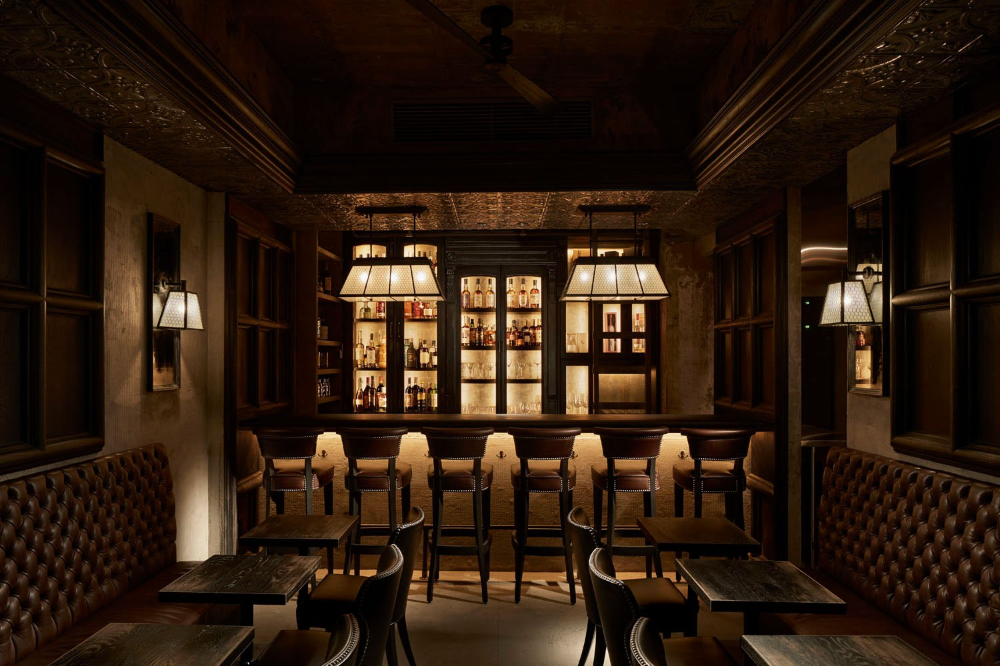 | https://sg-management.jp/image/sipguzzle/store/store-main02-sgclub.jpg (same page). The lower Sip room with banquettes. |
| tjoget | 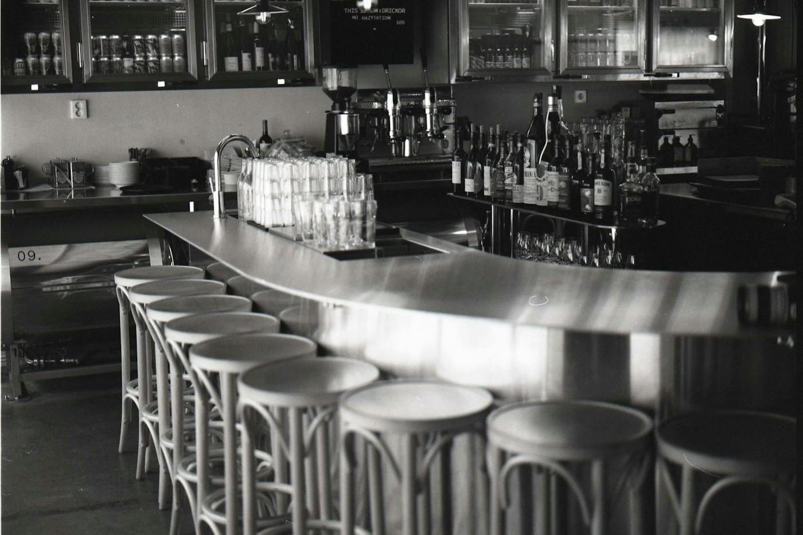 | https://images.prismic.io/tjoget/9f78015b-8d36-443e-8de6-bc562e86cdac_000318060009-min.jpg (tjoget.com). Black-and-white film shot of the curved counter with bentwood stools. |
| vesper | 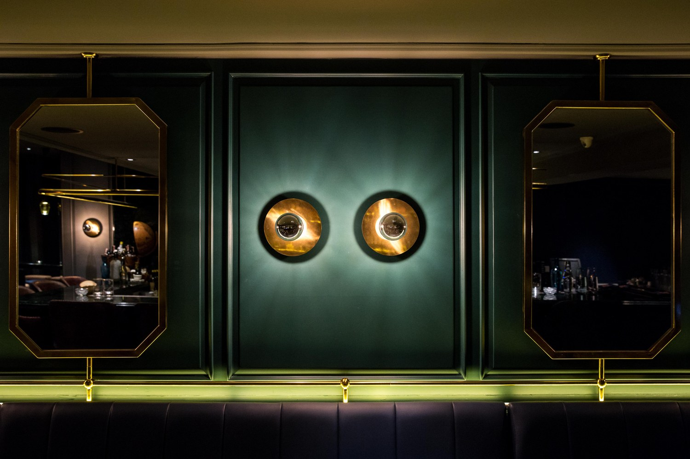 | https://static.wixstatic.com/media/22ede8_4f3b2b79cc424e0dadb430849ee4b290~mv2.jpg (vesperbar.co/reservation). Borderline: panelled wall with brass mirrors reflecting the bar, banquette below. |

## 4. Waiting on Roman

1. Slugs to approve from the two contact sheets.
2. The go to remove the 23 photos from the50.com listed in section 2 (Bar Trench, Boadas, Boilermaker, G.O.D, Kumiko, Naked, Opium, Vender, Bar Gabriel, Form + Matter, Freni e Frizioni, Front/Back, Gucci Giardino 25, La Borracha, Mius, MO Bar Shenzhen, Otro Bar, Röda Huset, The Bellwood, The SG Club, Three Horses, Tjoget, Vesper). Until then they stay live with their current credit.
